**Anomalies**
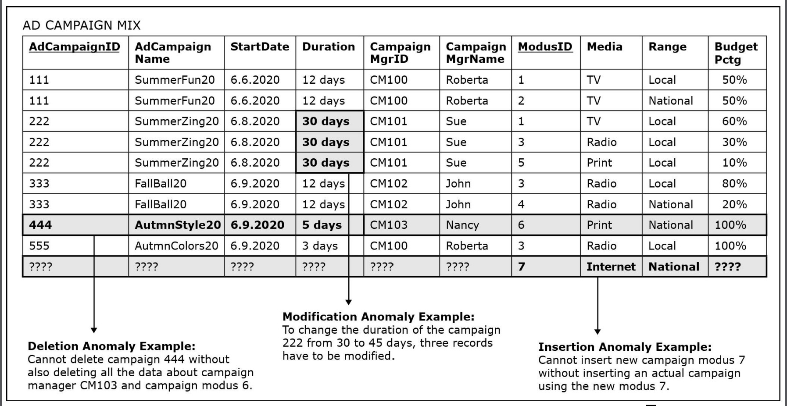

### Functional Dependency Rules
**Decomposition Rule**

If EmployeeID -> {Name, Address}    then EmployeeID -> Name and EmployeeID -> Address

**Union/Combining Rule**

if A-> B and A -> C, then A -> (B,C)

### Candidate and Superkey
- determine all of the other attributes in a relation
- candidate key is a minimal superkey
- a proper subset of the candidate key cannot determine all other attributes in a relation

### Foreign Key
Foreign keys link data in one table to the data in
another table. A foreign key column in a table points to a column
with unique values in another table (often the primary key
column) to create a way of cross-referencing the two 
tables.

### Types of functional Dependencies
**Partial functional depedency**

 occurs when a proper subset of the primary key in a relation determines non-prime attributes

 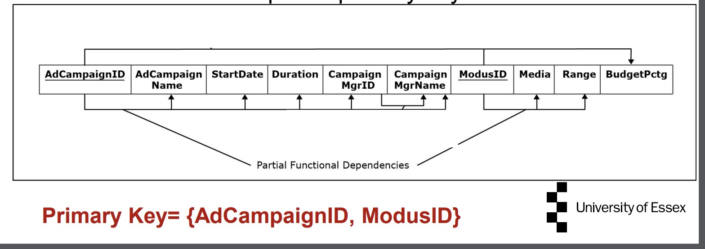

 **Full Key Functional dependency**

occurs when a primary key functionally determines the column of a relation and no separate component of the primary key partially determines the same column.

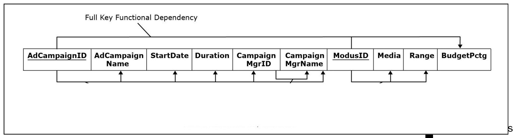

**Transistive functional dependency**

occurs when nonprime attribute(s) functionally determine other non-prime 
attribute(s) of a relation.

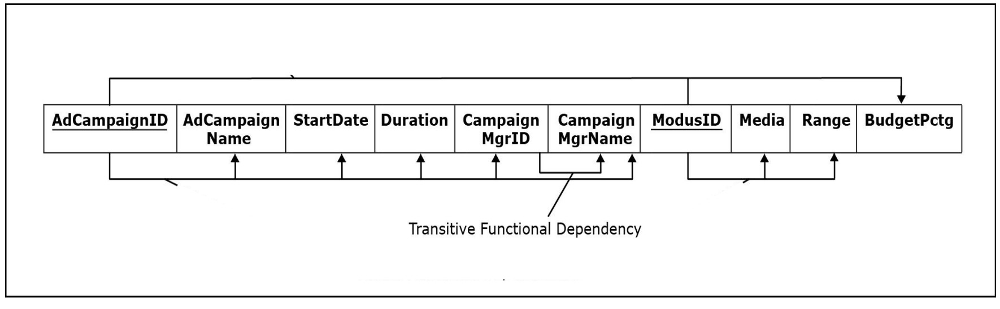

**2nd Normal Form**

- A relation is in 2NF if it is in 1NF and if it does not contain partial functional dependencies
- If a relation has a single-column primary key, then there is no possibility
of partial functional dependencies. Such relation is automatically in 2NF 
and it does not have to be normalized to 2NF

**3rd Normal Form**
- A relation is in 3NF if it is in 2NF and if it does not contain transitive functional dependencies

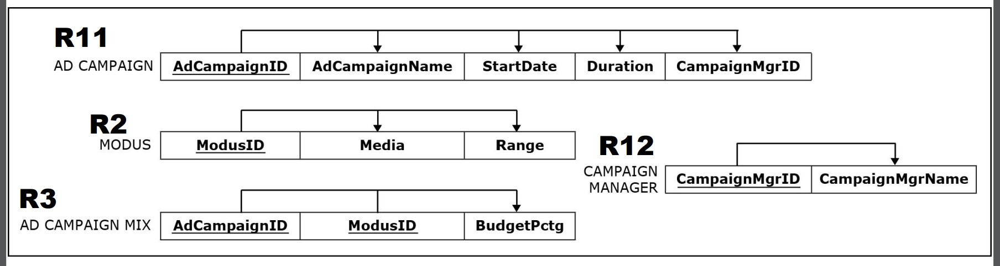

**Boyce-Codd Normal Form**
- A relation is in BCNF if and only if, it is in 3NF and every determinant is a candidate key.

**4NF**
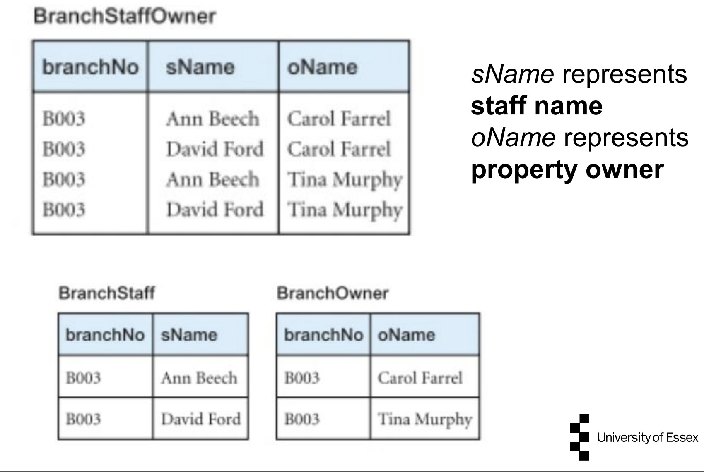

- It must be in Boyce Codd Normal Form (BCNF).
- It should have no non-trivial multivalued dependency.

**5NF**
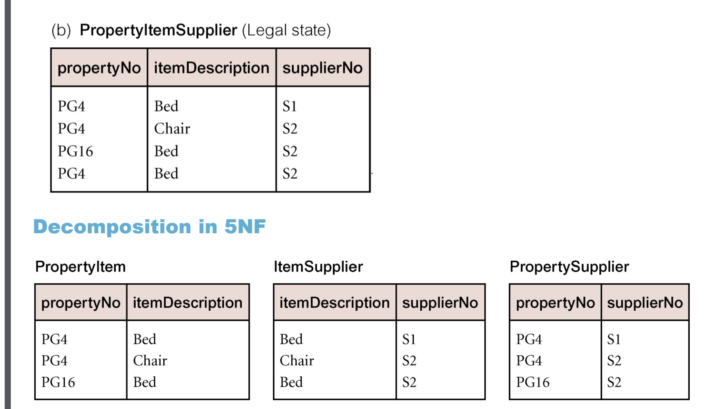

- relation must be in 4NF and further lossless decomposition of relation R is not possible

### Lossless Join Decomposition and Dependency preserving decomposition

- Decomposition of a relation into sub-relations such that a natural join of the sub-relations yields back the original relation.

To check for lossless join decomposition using given set 
of FD, following conditions must hold:
- Union of Attributes of R1 and R2 must be equal to 
attribute of R. 
- Intersection of Attributes of R1 and R2 must not be 
NULL.
- Common attribute must be a key for at least one 
relation (R1 or R2)

Now, join sub-relations R1(A,B,C,D,E,F), R2(G,H,I), R3(J) 
- Join should be lossless, therefore, there should be a common 
attribute which must be a candidate of any sub-relation R1 or R3. As 
{A} is a candidate key of R1, We will get
- R1(A,B,C,D,E,F) and R3(A,J)
- Similarly, {G} is candidate key of R2, so we will get
- R2(G,H,I) and R3(A,G,J)
- So, the lossless join of R(A,B,C,D,E,F,G,H,I,J) IS 
R1(A,B,C,D,E,F) R2(G,H,I) R3(A,G,J)
- Now relation R is in 2NF

**Join Dependency**

A join dependency (JD) can be said to exist if the join of R1(A,B,C) and R2(C,D) over C is equal to relation R (A, B, C, D), where R1 and R2 is a lossless decomposition of R.

### Security Breaches
**Theft and Fraud**
- theft and fraud affect not only the database environment but also the entire organization
- theft and fraud does not necessarily alter data, as is the case for activities that result in either loss of confidentiality or loss of privacy

**Confidentiality** : secrecy of data

**Privacy** : protection of data

**loss of confidentialtiy** could lead to loss of competitiveness.
**loss of privacy** could lead to legal action being taken against the organisation.

**loss of integrity**; results in invalid or corrupted data

**loss of availability**; data. or the system, or both cannot be accessed.
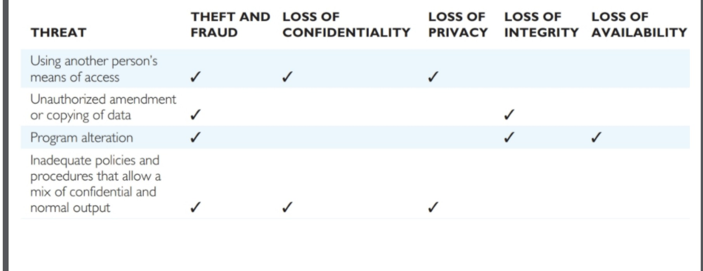

**Authorisation**
- The granting of a right or privilege, which enables a subject to legitimately have access to a system or a system’s object.

**Authentication**
- Mechanism that determines whether a user is, who he or she claims to be

**Access control**
- Based on the granting and revoking of privileges.
- A privilege allows a user to create or access (that is read, write, or modify) some database object (such as a relation, view, and tuples) or to run certain DBMS utilities.

**Discretionary Access control (DAC)**
- Identity based
- The controls are discretionary in the sense that a subject with a certain access permission is capable of passing that permission (perhaps indirectly) on to any other subject (unless restrained by mandatory access control)”.
- SQL standard supports DAC through the GRANT and REVOKE commands.

**Mandatory Access control (MAC)**
- Each database object is assigned a security class and 
- Each user is assigned a clearance for a security class 
- Rules are imposed on reading and writing of database objects

**Domain integrity constraint**

The requirement that all the values in a column are of the same kind is known as the domain integrity constraint.

**Entity integrity constraint**

The requirement that, in order to function properly, the primary key must have unique data values inserted into every row of the table. This is known as the entity integrity constraint.

**Referential integrity constraint**

A referential integrity constraint is a statement that limits the values of the foreign key to those already existing as primary key values in the corresponding relation

### Business Intelligence
- Business intelligence (BI) systems are information systems that assist managers and other professionals in the analysis of current and past activities and in the prediction of future events.
- they do not support operational activities, such as the recording or processing of orders.
- BI systems are used to support management assessment, analysis, planning, control, and, ultimately, decision making.

**Categories of BI systems**
- Reporting systems
    - sort, filter, group, and make elementary calculations on operational data.
    - creates meaningful information from different data sources
- Data mining applications
    - perform sophisticated analyses on data, analyses that usually involve complex statistical and mathematical processing

**Data analytics in business**
- Data analytics is used in business to help organizations make better business decisions.
- Analyzing data will provide insights that organizations need in order to make the right choices.
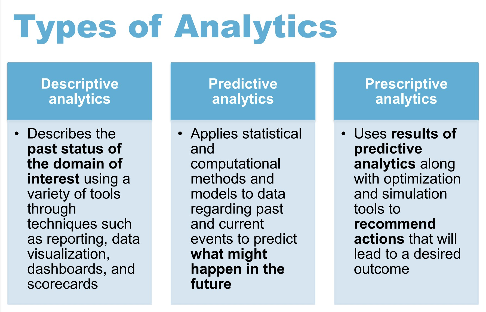

**Fisher's discriminant ratio**
- If FDR is high, the corresponding features are good to discriminate between the given classes. 
- If FDR is low, the corresponding features are not good to discriminate between the given classes.

### Data mining
- extraction of implicit, previously unknown and potentially useful information from data Exploration & analysis, by automatic or semi-automatic means, of large quantities of data in order to discover meaningful patterns

### Online transaction processing system
- is used to record all sales transactions of the company (whether in a store, on the Web, or from mail order or phone order sales).
- OLTP systems are backbones of businesses as they operate today

**Ways to access data by a BI system**

1. BI systems read and process data existing in the 
operational database
    - they use the operational DBMS to obtain such data, but 
they do not insert, modify, or delete operational data. 
2. BI systems process data that are extracted 
from operational databases. 
    - they manage the extracted database using a BI DBMS, 
which may be the same as or different from the 
operational DBMS. 
3. BI systems read data purchased from data vendor.

**Data Access from operational Database**
- Some BI systems read and process operational data directly from the operational database. 
- Although this is possible for simple reporting systems and small databases, such direct reading of operational data is not feasible for more complex applications or larger databases. 
- Those larger applications usually process a separate database constructed from an extract of the operational database.

### Data warehouses
- data warehouses are database systems that have data, programs and personnel for BI processing.
- Data warehouse databases differ from operational databases because the data warehouse data is frequently denormalized.
- Further, that data is never inserted, updated, or deleted by users, but only by data warehouse administrators.
- They can be as simple as a sole employee processing a data extract on a part-time basis. OR
- as complex as a department with dozens of employees maintaining libraries of data and programs.

**Components of a data warehouse; ETL system**
- Data are read from operational databases by the Extract, Transform, and Load (ETL) system. 
- The ETL system then cleans and prepares the 
data for BI processing. 
- Data maybe problematic.
- Data may need to change or be transformed.
- The ETL stores the extracted data in a data warehouse database using a data warehouse DBMS, which can be different from the organization’s operational DBMS. 

### Data mart
- A data mart is a collection of data that is smaller than that in the data warehouse and
- that addresses a particular component or functional area of the business.

### Enterprise Data Warehouse
- When the data mart structure is combined with the data warehouse architecture, the combined system is known as an enterprise data warehouse (EDW) architecture.
- In this configuration, the data warehouse maintains all enterprise BI data and acts as the authoritative source for data extracts provided to the data marts.
- The data marts receive all their data from the data warehouse—they do not add or maintain any additional data.

- **Transient** - changes to existing records are written over previous records, destroying previous data content.
- **Periodic** - data is never physically altered or deleted.

### RFM analysis
- RFM analysis is a way of analyzing and ranking 
customers according to their purchasing patterns. 
- It is a simple technique that considers 
    - how recently (R score) a customer ordered, 
    - how frequently (F score) a customer orders, 
    - and how much money (M score) the customer spends per order.

**Structured Data** is highly-organized and formatted in a way so it's easily searchable in relational databases.

**Unstructured Data** has no pre-defined format or 
organization, making it much more difficult to collect, 
process, and analyze.
- Typically refers to free text
- Allows Keyword queries including operators. More sophisticated “concept” queries.
- Databases deal with structured information retrieval through well-defined formal languages for representation and manipulation based on the theoretically founded data models. 
    - Efficient algorithms have been developed for operators that allow rapid execution of complex queries. 
- IR, on the other hand, deals with unstructured search 
with possibly vague query or search semantics. 

### Schema
- Databases have fixed schemas defined in some data model such as the relational model. 
- IR system has no fixed data model; 
    - IR views data or documents according to some scheme (vector space model)

### Queries
- Databases using the relational model employ SQL for queries and transactions.
- In IR systems, there is no fixed language for 
defining the structure (schema) of the document or for operating on the document
    - queries tend to be a set of query terms (keywords) or a free-form natural language phrase.

- A database query returns a new relation (table) providing an exact answer for the current state of the database.
- An IR query result is a list of document id’s, or some pieces of text or multimedia objects (images, videos, and so on), or a list of links to Web pages.
- The result of a database query is an exact answer.
- On the other hand, the answer to a user request in an IR query represents the IR system’s best attempt at retrieving the information most relevant to that query.

### Levels of scale (IR system)
- Enterprise search systems offer IR solutions for searching different entities in an enterprise’s intranet.
- Desktop search engines for retrieving files or folders

### Search Engine
- A search engine is a practical application of information retrieval to large-scale document collections.
- The part of a search engine responsible for discovering, analyzing, and indexing these new documents is known as a crawler.

### Effectiveness of an IR system
- **Precision**: What fraction of the returned results are relevant to the information need?
- **Recall**: What fraction of the relevant documents in the collection were returned by the system?

### Document Preprocessing
- Tokenization
- Lemmatization; reduce variant form to base forms
- Stemming; collapses derivationally related words to their stem
- Case-folding
- Stop-words; as,are,a,an, of, be, for

### Term document incidence matrix
- each row corresponds to a term
- and each column corresponds to a document

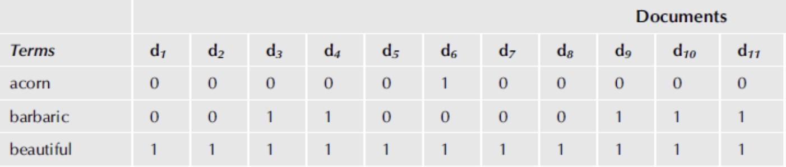
- The terms in the matrix are maintained in sorted order for processing efficiency. 
- Using this matrix, one can easily find 
    - all documents that contain a given term, and 
    - all terms that are present in a document

### Boolean Model
- Boolean model represents documents by a set of terms.
- A term’s value in a document is true if the term is present in the document, false otherwise.
- terms are not weighted.
- documents are not ranked.

### Effectiveness of boolean model
- The model is simple to implement. 
- It is surprisingly effective in retrieving relevant documents, provided the end user knows the domain vocabulary and can write relatively complex Boolean queries. 
- It is especially suitable for domains such as legal research, where achieving high recall is the overriding goal even at the cost of low precision. 

**Issues with term document incidence matrix**
- requires large storage.
- lack of support for more complex query operators.

### Inverted Index
- The dictionary is shown in the first column. 
    - It is an ordered list of vocabulary terms.
    - In addition to the term name, the document frequency of the term is also indicated.
    - The document frequency of a term is the number of documents in the collection in which a term occurs.
- Compared to the term-document incidence matrix, inverted index is an efficient representation from the perspective of both storage and processing requirements.

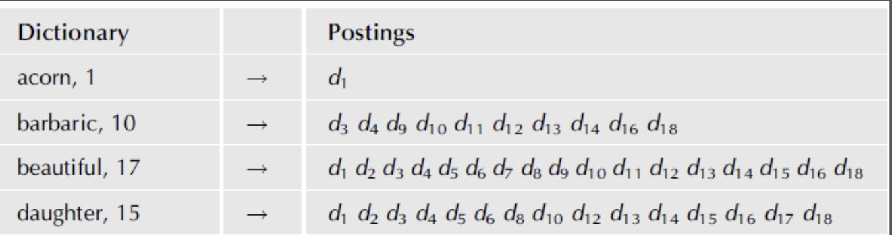

### Issues in computing inverted indexes
- Creating an inverted index for enterprise IR systems and web search engines poses special challenges.
- The size of the intermediate files generated during the index construction process is orders of magnitude greater than the primary memory available on most computers.
- Therefore, external sorting algorithms and compression/decompression techniques are critical to index construction and usage.

### Jaccard Coefficient
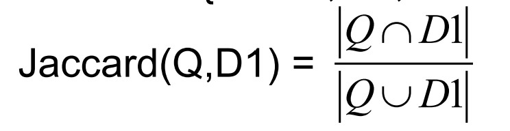

### Issues with jaccard for scoring
- It does not consider term frequency (how many times a term occurs in a document).
- Rare terms in a collection are more informative than frequent terms. Jaccard coefficient does not consider this information.

### Term Frequency
- The term frequency tf t,d of term t in document d is defined as the number of times that term t occurs in document d.
- rare terms are more informative than frequent terms.

### Document Frequency
- For frequent terms, we want high positive weights for words like high, increase, and line but lower weights than for rare terms.

### Inverse Document Frequency (IDF)
- dft is the document frequency of t: the number of documents that contain t
- idf (inverse document frequency) is the Reciprocal of how often Term appears in entire doc collection: 1/df.

### tf-idf weighting
- The higher the frequency of a term in a doc, the better the doc matches our query term.
- The higher the frequency of the term in docs, generally, the worse it is as a search term.
- tf-idf = tf*idf
- highest when term t occurs many times within a small number of documents;
- lower when the term occurs fewer times in a document, or occurs in many documents;
- lowest when the term occurs in virtually all documents.

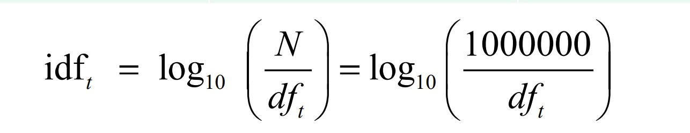

### Vector Space Model
- A collection of n documents can be represented in the vector space model by a document-term matrix.
- An entry in the matrix corresponds to the “weight” of a term in the document; zero means the term has no significance in the document or it simply doesn’t exist in the document.

### Evaluation of IR System
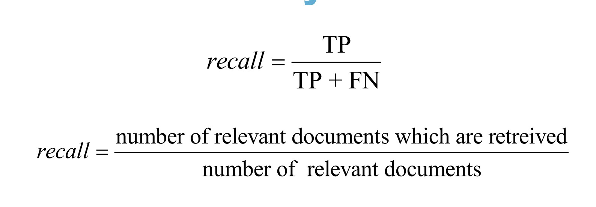
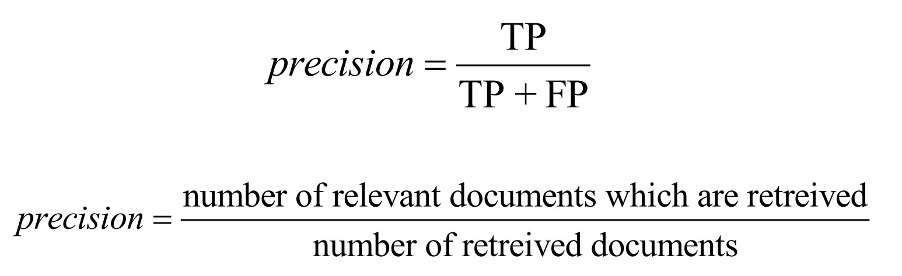

### Precision and Recall tradeoff
- You can increase recall by returning more docs.
- Recall is a non-decreasing function of the number of docs retrieved.
- A system that returns all docs has 100% recall!
- The converse is also true (usually): It’s easy to get high precision for very low recall.

### NoSQL
NoSQL focuses on 
- semi-structured data storage
- high performance
- Availability
- data replication
- scalability

- There are four main types of NoSQL models
    - key-value stores
    - document stores
    - wide-column stores
    - graph stores

### Scalability
- There are two kinds of scalability: horizontal and vertical.
- In NoSQL systems, horizontal scalability is generally used, where the distributed system is expanded by adding more nodes for data storage and processing as the volume of data grows.
- Vertical scalability (an older model used in the context of the relational model), refers to expanding the storage and computing power of existing nodes.

### Availability, Replication and Eventual Consistency
- Many applications that use NoSQL systems require continuous system availability.
- To accomplish this, data is replicated over two or more nodes in a transparent manner.
- Replication improves data availability and can also improve read performance.
- In NoSQL, more relaxed forms of consistency known as eventual consistency are used.
- In many NoSQL applications, files (or collections of data 
objects) can have many millions of records (or documents or objects), and these records can be accessed concurrently by thousands of users. So, it is not practical to store the whole collection in one node.

### Sharding
- Sharding (also known as horizontal partitioning) of the file records is often employed in NoSQL systems. 
- This serves to distribute the load of accessing the file records to multiple nodes. 
- The combination of sharding the file records and replicating the shards works in tandem to improve load balancing as well as data availability.

### Schemas and Queries
- The users can specify a partial schema in some systems to improve storage efficiency, but it is not required to have a schema in most of the NoSQL systems.
- Many applications that use NoSQL systems may not require a powerful query language such as SQL, because search (read) queries in these systems often locate single objects in a single file based on their object keys.

- Availability:
    - Each read or write request for a data item will either be processed successfully or will receive a message that the operation cannot be completed. 
- Partition tolerance or robustness:
    - A given system continues to operate even with data loss or system failure. A single node failure should not cause the entire system to collapse. 
- Consistency: 
    - The nodes will have the same copies of a replicated data item visible for various transactions.

### Choosing RDBMS, NoSQL or IR
- Your data might favor a table/row structure of RDBMS, a document structure, or a simple key-value pair structure.
- A downside of NoSQL is that most solutions are not as strong in ACID (Atomic, Consistency, Isolation, Durability) as in the more well-established RDBMS systems.
- If speed is the most critical factor for your database, NoSQL might fit your data well and can provide a huge performance boost.

**RDBMS**
- schema flexibility
    - structured data fits naturally into RDBMS schemes.
    - while not as flexible as NoSQl, schema changes are manageable and well-supported.
- scalability
    - vertical scaling is robust and modern RDBMS offers some horizontal scaling.
    - suitable for moderate to large structured datasets.
- Query response
    - supports rich SQL querying, including jobs, subqueries, aggregations.
    - highly optimised for complex queries on structured data.
    - mature indexing and transaction systems ensure fast, consistent performance.

**NoSQL**
- Schema Flexibility
    - Excellent for schema-less or evolving data, but unnecessary for well-defined structured data.

    - Storing structured data in NoSQL (e.g., key-value or document models) may lead to data redundancy and complicated querying.

- Scalability
    - Very good horizontal scalability, but that advantage is only crucial at web-scale levels (e.g., millions of users).

- Query Response
    - Lacks complex query support (limited joins, weak consistency depending on type).

Would complicate structured data retrieval, especially when relationships exist between entities.

**IR**
- Schema Flexibility
    - IR systems like Lucene or ElasticSearch are built for text-heavy, unstructured or semi-structured data.

- Scalability
    - Highly scalable, especially for full-text search, but not designed for structured relational data.

- Query Response
    - Fast for text searches, but inefficient or awkward for relational queries (e.g., joins, constraints).

Not transactional, which limits consistency and integrity.
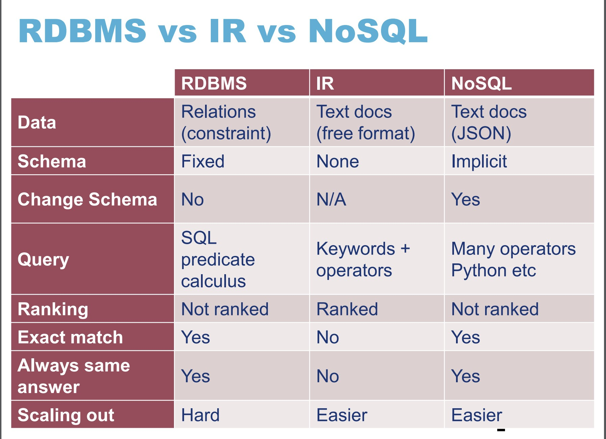